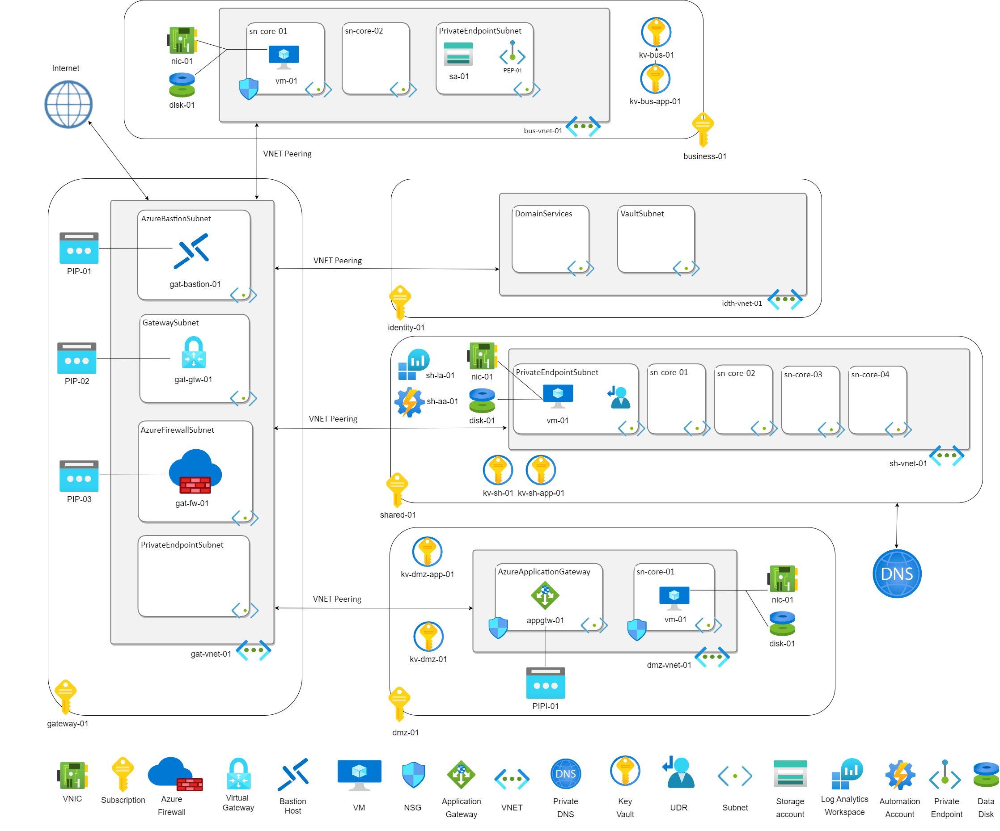
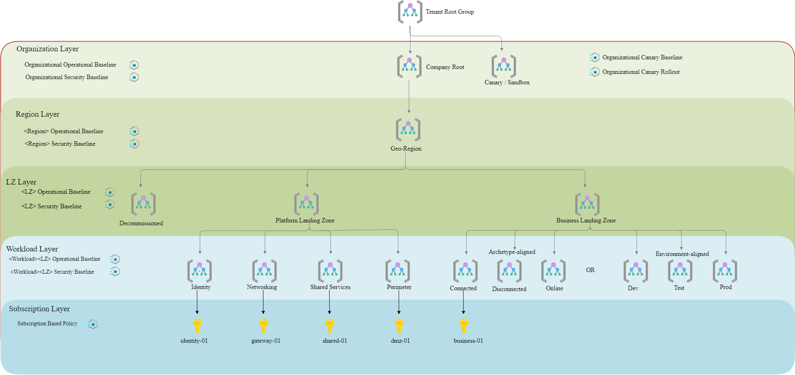
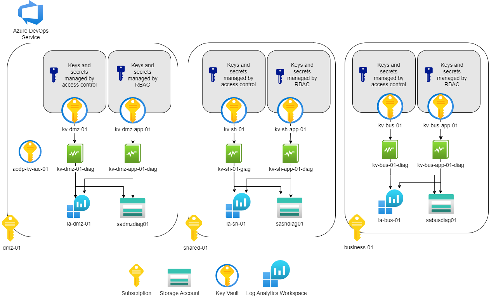

# Overview

Starting Cloud Journey is a hard and challenging process for every company. Setting up an initial technical baseline is a crucial part of this process. Making mistakes on initial step brings not only security, reputational and financial risks, but also takes a great amount of time to fix them in the future.​

EPAM experienced cloud engineering team enforced by unified approach, predefined templates and codified baseline architecture footprints can make this process fast, effective and highly adoptive to client’s business goals by utilizing **EPAM Azure Landing Zone offerings**. These Offerings are based on Cloud best practices and EPAM recommendations empowered by Infrastructure as a Code templates adopted to Customer’s cloud demand will reduce risks of mistakes in fundamental Cloud setup process or during the delivery of platform, business, and secure landing zones.

This **Demo** solution is a part of **EPAM Azure Landing Zone offerings** that delivers a demo environment for playground or sandboxes. The demo solutions follow the start small and expand approach that accounts for scale, security, governance, networking, and identity. The solution allows you to deploy an infrastructure to get acquainted with the capabilities of Azure Landing Zone Offerings/frameworks and IaC approach. 


# Architecture

The **Demo** solution is based on the Terraform and EPAM owned child modules for each Azure Resource. It is a complete standalone solution that allows you to build a fundament of your cloud infrastructure. The **Demo** solution consist of the following components:

- Governance
  - Management groups
  - Policy Definitions
  - Policy Initiative
  - Resource group
  - Diagnostic settings
  - Automation account
- Network
  - Virtual Networks
  - Virtual Network Peering
  - Subnets
  - Private endpoint
  - Network Security Groups
  - Application Security Groups
  - Azure Firewall
  - Bastion
  - UDR
  - Application Gateway
  - Private DNS
  - Virtual Network gateway
  - Public IP
- Storage
  - Storage account
  - Log Analytics workspace
- Security
  - Key vault
  - Defender for Coud
  - Managed Identity
- Workload
   - VM
   - VNIC
   - Disk


The **Demo** solution is based on the traditional hub-and-spoke network topology where hub virtual network acts as a central point of connectivity for other virtual networks. The hub can also be used as a connectivity point for on-premises networks. 

During deployment, passwords for virtual machines are transmitted by secrets located in Key Vault (they are also deployed in the solution). After the deployment, it is possible to connect to virtual machines using the Bastion service. Private Endpoint is used to access the Storage Account. NSG and Firewall rules are also configured.

The diagram below provides a high-level overview of the solution:



## Organizational structure


The **Demo** solution leverages management groups for efficient access management, policies assignment, and subscription management. The management groups follow the layered approach with respective policy initiatives assignment on each level. The diagram below provides an overview:



The **Demo** solution leverage five subscriptions to split and isolated different workload types:

- **Gateway** - Is the entry-point of the whole solution that provides access to the solution from the Internet or on-premise networks and provides communication between the other environments.
- **Shared** - It contains shared resources that need to be accessed for the functioning of the solution elements in the rest of the environment.
- **Identity** - designed for resources that store sensitive information and provide access control. This creates an opportunity to further protect our shared services like Domain Controllers, different authentication services, secure data management systems and etc..
- **DMZ** - the spoke is designed to place resources open for Internet access, which need to be separated from the internal network. DMZs function as a buffer zone between the public Internet and the rest of the environments.
- **Business** - Is an environment that is designed to deploy the resources that are used initially to achieve the goals and objectives of the business.


## Azure Key Vault management

The solution deploys three types of the Azure Key Vault:

- The prerequisite Key Vault - is one within the solution. Used to store sensitive data required for Terraform operation.
- Infrastructure Key Vault - one for each environment, key/secret access based on access policies. It is used to store secret data used to create Azure resources, such as passwords for virtual machine user accounts.
- Application Key Vault - one for each environment, key/secret access based on RBAC. It is used to store secret data used in the application, such as account passwords.

For Infrastructure Key Vault and Application Key Vault diagnostic settings are enabled, collected logs and metrics are stored in Log Analytics workspaces for each environment (subscription) and duplicated in the storage account for each environment (subscription)



## Prerequisites

To deploy a **Demo** solution within your landscape, you will need:

- Azure Cloud subscription.
- Azure Cloud Service Principal with "Management Group Contributor" and "Owner" (at least "Contributor" and "User Access Administrator" if "Owner" is not available) permissions at the Root Management Group level.
- Installed on the local machine tools: 
  - git
  - Terraform
  - PowerShell(pwsh)

The solution is designed for deployment in five subscriptions. You can create 
- a separate Azure Resource Manager service connection for each of them at Azure subscription level scope.
- or use a single one at scope of Management Group (with Azure subscriptions inside). 

## Manual deploy instruction using PowerShell syntax
1. Clone the repository and navigate on it
```
git clone https://github.com/epam/azurelz.git
cd azurelz

```
2. Set variables:
```pwsh
# Terraform connection variables
$env:ARM_CLIENT_ID     = "00000000-1111-2222-3333-444444444444"
$env:ARM_CLIENT_SECRET = '<secret for ARM_CLIENT_ID>'

# Subscription variables
$env:ARM_TENANT_ID = "00000000-1111-2222-3333-444444444444"
$sub_business      = "00000000-1111-2222-3333-444444444444"
$sub_dmz           = "00000000-1111-2222-3333-444444444445"
$sub_gateway       = "00000000-1111-2222-3333-444444444446"
$sub_identity      = "00000000-1111-2222-3333-444444444447"
$sub_shared        = "00000000-1111-2222-3333-444444444448"

# SP variables
$sp_object_id = 'SERVICE_PRINCIPAL_OBJECT_ID'

```
3. replace tokens `#{ENV_AZURE_SUBSCRIPTION_ID}#` and `#{ENV_AZURE_SP_OBJECT_ID}#` in each config files:
```pwsh
### BASE_LAYER
# business
(Get-Content .\demo_solution\configuration\base_layer\epam.business.env.demo.tfvars).replace(
'#{ENV_AZURE_SUBSCRIPTION_ID}#', $sub_business) |
Set-Content  .\demo_solution\configuration\base_layer\epam.business.env.demo.tfvars

(Get-Content .\demo_solution\configuration\base_layer\epam.business.env.demo.tfvars).replace(
'#{ENV_AZURE_SP_OBJECT_ID}#', $sp_object_id) |
Set-Content  .\demo_solution\configuration\base_layer\epam.business.env.demo.tfvars

# dmz
(Get-Content .\demo_solution\configuration\base_layer\epam.dmz.env.demo.tfvars).replace(
'#{ENV_AZURE_SUBSCRIPTION_ID}#', $sub_dmz) |
Set-Content  .\demo_solution\configuration\base_layer\epam.dmz.env.demo.tfvars

(Get-Content .\demo_solution\configuration\base_layer\epam.dmz.env.demo.tfvars).replace(
'#{ENV_AZURE_SP_OBJECT_ID}#', $sp_object_id) |
Set-Content  .\demo_solution\configuration\base_layer\epam.dmz.env.demo.tfvars

# gateway
(Get-Content .\demo_solution\configuration\base_layer\epam.gateway.env.demo.tfvars).replace(
'#{ENV_AZURE_SUBSCRIPTION_ID}#', $sub_gateway) |
Set-Content  .\demo_solution\configuration\base_layer\epam.gateway.env.demo.tfvars

(Get-Content .\demo_solution\configuration\base_layer\epam.gateway.env.demo.tfvars).replace(
'#{ENV_AZURE_SP_OBJECT_ID}#', $sp_object_id) |
Set-Content  .\demo_solution\configuration\base_layer\epam.gateway.env.demo.tfvars

# identity
(Get-Content .\demo_solution\configuration\base_layer\epam.identity.env.demo.tfvars).replace(
'#{ENV_AZURE_SUBSCRIPTION_ID}#', $sub_identity) |
Set-Content  .\demo_solution\configuration\base_layer\epam.identity.env.demo.tfvars

(Get-Content .\demo_solution\configuration\base_layer\epam.identity.env.demo.tfvars).replace(
'#{ENV_AZURE_SP_OBJECT_ID}#', $sp_object_id) |
Set-Content  .\demo_solution\configuration\base_layer\epam.identity.env.demo.tfvars

# shared
(Get-Content .\demo_solution\configuration\base_layer\epam.shared.env.demo.tfvars).replace(
'#{ENV_AZURE_SUBSCRIPTION_ID}#', $sub_shared) |
Set-Content  .\demo_solution\configuration\base_layer\epam.shared.env.demo.tfvars

(Get-Content .\demo_solution\configuration\base_layer\epam.shared.env.demo.tfvars).replace(
'#{ENV_AZURE_SP_OBJECT_ID}#', $sp_object_id) |
Set-Content  .\demo_solution\configuration\base_layer\epam.shared.env.demo.tfvars


### WORK_LAYER

# business
(Get-Content .\demo_solution\configuration\work_layer\epam.business.env.demo.tfvars).replace(
'#{ENV_AZURE_SUBSCRIPTION_ID}#', $sub_business) |
Set-Content  .\demo_solution\configuration\work_layer\epam.business.env.demo.tfvars

(Get-Content .\demo_solution\configuration\work_layer\epam.business.env.demo.tfvars).replace(
'#{ENV_AZURE_SP_OBJECT_ID}#', $sp_object_id) |
Set-Content  .\demo_solution\configuration\work_layer\epam.business.env.demo.tfvars

# dmz
(Get-Content .\demo_solution\configuration\work_layer\epam.dmz.env.demo.tfvars).replace(
'#{ENV_AZURE_SUBSCRIPTION_ID}#', $sub_dmz) |
Set-Content  .\demo_solution\configuration\work_layer\epam.dmz.env.demo.tfvars

(Get-Content .\demo_solution\configuration\work_layer\epam.dmz.env.demo.tfvars).replace(
'#{ENV_AZURE_SP_OBJECT_ID}#', $sp_object_id) |
Set-Content  .\demo_solution\configuration\work_layer\epam.dmz.env.demo.tfvars

# gateway
(Get-Content .\demo_solution\configuration\work_layer\epam.gateway.env.demo.tfvars).replace(
'#{ENV_AZURE_SUBSCRIPTION_ID}#', $sub_gateway) |
Set-Content  .\demo_solution\configuration\work_layer\epam.gateway.env.demo.tfvars

(Get-Content .\demo_solution\configuration\work_layer\epam.gateway.env.demo.tfvars).replace(
'#{ENV_AZURE_SP_OBJECT_ID}#', $sp_object_id) |
Set-Content  .\demo_solution\configuration\work_layer\epam.gateway.env.demo.tfvars

# identity
(Get-Content .\demo_solution\configuration\work_layer\epam.identity.env.demo.tfvars).replace(
'#{ENV_AZURE_SUBSCRIPTION_ID}#', $sub_identity) |
Set-Content  .\demo_solution\configuration\work_layer\epam.identity.env.demo.tfvars

(Get-Content .\demo_solution\configuration\work_layer\epam.identity.env.demo.tfvars).replace(
'#{ENV_AZURE_SP_OBJECT_ID}#', $sp_object_id) |
Set-Content  .\demo_solution\configuration\work_layer\epam.identity.env.demo.tfvars

# shared
(Get-Content .\demo_solution\configuration\work_layer\epam.shared.env.demo.tfvars).replace(
'#{ENV_AZURE_SUBSCRIPTION_ID}#', $sub_shared) |
Set-Content  .\demo_solution\configuration\work_layer\epam.shared.env.demo.tfvars

(Get-Content .\demo_solution\configuration\work_layer\epam.shared.env.demo.tfvars).replace(
'#{ENV_AZURE_SP_OBJECT_ID}#', $sp_object_id) |
Set-Content  .\demo_solution\configuration\work_layer\epam.shared.env.demo.tfvars


```

4. replace token `#{ENV_AZURE_TENANT_ID}#` in     "demo_solution/configuration/base_layer/epam.identity.env.demo.tfvars" file.

```pwsh
(Get-Content .\demo_solution\configuration\base_layer\epam.identity.env.demo.tfvars).replace(
'#{ENV_AZURE_TENANT_ID}#', $env:ARM_TENANT_ID ) |
Set-Content  .\demo_solution\configuration\base_layer\epam.identity.env.demo.tfvars
```

5. Deploy Base Layer to all environments
```pwsh
cd .\demo_solution\base_layer\
terraform init
terraform validate
terraform workspace new epam.business.env.demo
terraform workspace new epam.dmz.env.demo
terraform workspace new epam.gateway.env.demo
terraform workspace new epam.identity.env.demo
terraform workspace new epam.shared.env.demo

$env:ARM_SUBSCRIPTION_ID = $sub_business
terraform workspace select epam.business.env.demo
terraform apply -var-file="../configuration/base_layer/epam.business.env.demo.tfvars" -auto-approve

$env:ARM_SUBSCRIPTION_ID = $sub_dmz
terraform workspace select epam.dmz.env.demo
terraform apply -var-file="../configuration/base_layer/epam.dmz.env.demo.tfvars" -auto-approve

$env:ARM_SUBSCRIPTION_ID = $sub_gateway
terraform workspace select epam.gateway.env.demo
terraform apply -var-file="../configuration/base_layer/epam.gateway.env.demo.tfvars" -auto-approve

$env:ARM_SUBSCRIPTION_ID = $sub_identity
terraform workspace select epam.identity.env.demo
terraform apply -var-file="../configuration/base_layer/epam.identity.env.demo.tfvars" -auto-approve

$env:ARM_SUBSCRIPTION_ID = $sub_shared
terraform workspace select epam.shared.env.demo
terraform apply -var-file="../configuration/base_layer/epam.shared.env.demo.tfvars" -auto-approve

```

6. Deploy Work Layer to all environments
```pwsh
cd ..\work_layer
terraform init
terraform validate
terraform workspace new epam.business.env.demo
terraform workspace new epam.dmz.env.demo
terraform workspace new epam.gateway.env.demo
terraform workspace new epam.identity.env.demo
terraform workspace new epam.shared.env.demo

$env:ARM_SUBSCRIPTION_ID = $sub_business
terraform workspace select epam.business.env.demo
terraform apply -var-file="../configuration/work_layer/epam.business.env.demo.tfvars" -auto-approve

$env:ARM_SUBSCRIPTION_ID = $sub_dmz
terraform workspace select epam.dmz.env.demo
terraform apply -var-file="../configuration/work_layer/epam.dmz.env.demo.tfvars" -auto-approve

$env:ARM_SUBSCRIPTION_ID = $sub_gateway
terraform workspace select epam.gateway.env.demo
terraform apply -var-file="../configuration/work_layer/epam.gateway.env.demo.tfvars" -auto-approve

$env:ARM_SUBSCRIPTION_ID = $sub_identity
terraform workspace select epam.identity.env.demo
terraform apply -var-file="../configuration/work_layer/epam.identity.env.demo.tfvars" -auto-approve

$env:ARM_SUBSCRIPTION_ID = $sub_shared
terraform workspace select epam.shared.env.demo
terraform apply -var-file="../configuration/work_layer/epam.shared.env.demo.tfvars" -auto-approve

```

6. For destroy you need to start with Work layer, then destroy Base layer. Use terraform select <workspace> for switching to target environment.


# Documents
- Some Terraform best practices you can found [here](./docs/Best-practices-for-using-Terraform.md)

# Contributing

Please check out our [contributing guidelines](CONTRIBUTING.md).

# License

Copyright (C) 2025 EPAM Systems Inc.
The LICENSE file in the root of this project applies unless otherwise indicated. 
