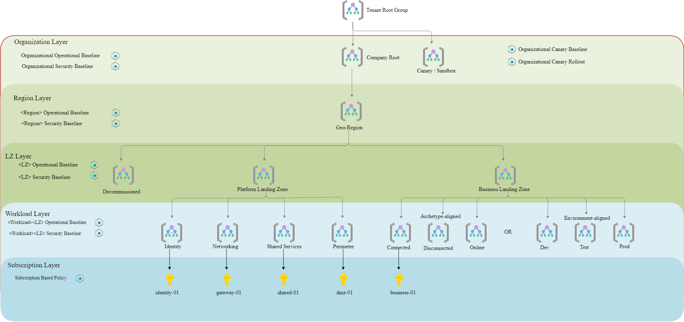
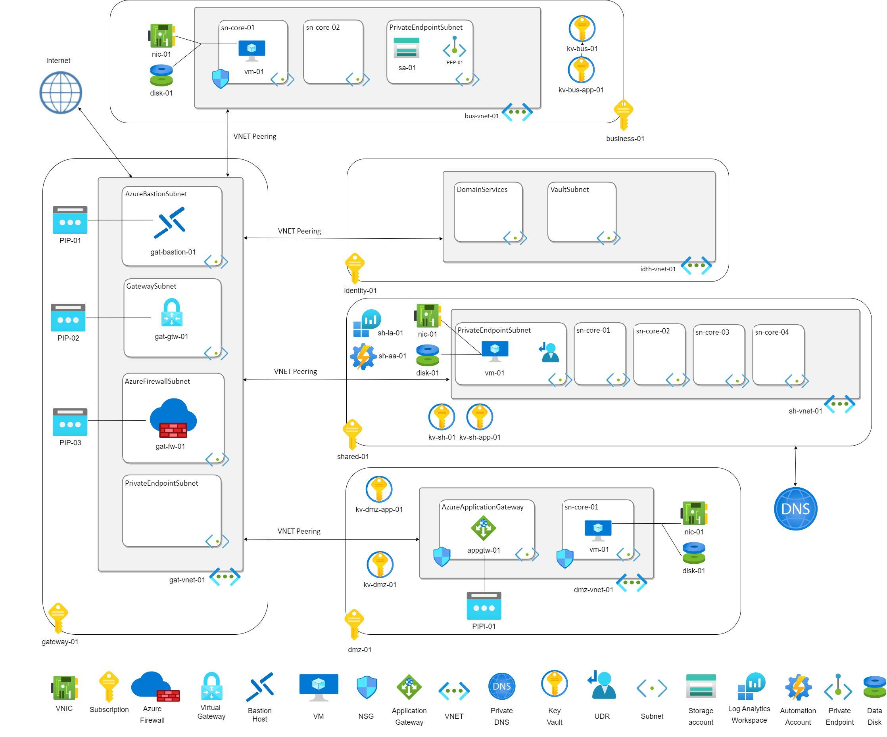
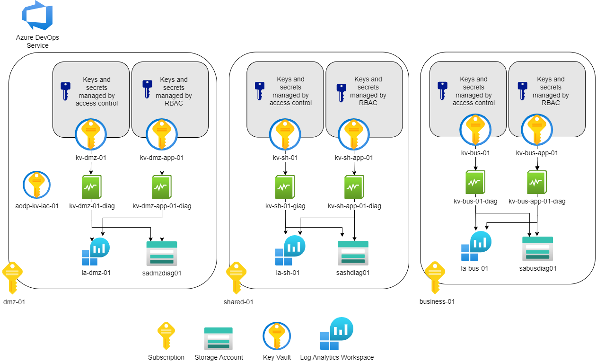

[[_TOC_]]

# Overview
**Demo** is a demo solution that allows us to deploy an infrastructure to get acquainted with the capabilities that Azure Landing Zone provides. It represents a hub-and-spoke type of network architecture in Azure. The hub virtual network acts as a central point of connectivity for many space virtual networks. The hub can also be used as a connectivity point for on-premise networks. The spoke virtual networks communicate with the hub and are useful for isolating workloads. Using different subscriptions, the **Demo** solution allows you to flexibly and granularly manage resources and share architecture costs between different parts of the business.

# Terraform development documentation

- [Terraform code development](./docs/Terraform-code-development.md)
- [Terraform initial resources management](./docs/Terraform-initial-resources-management.md)
- [Terraform resources deployment order](./docs/Terraform-resources-deployment-order.md)

# Architecture


**Demo** solution based on the configuration for existing Terraform root modules. It is a complete standalone solution and allows you to create a network infrastructure, workload (Storage Account, VMs, etc.) and management resources.

- Management groups - provide a governance scope above subscriptions;
- Policy Initiative - Azure Policy sets that help implement organizational standards and assess compliance at scale;
- Resource group - holds related resources for a **Demo** solution;
- Storage account - used by Terraform for storing state files and performing the role of a workload;
- Log Analytics workspace - a workspace is a location where data from resources and solutions can be logged;
- Diagnostic settings - defines the settings for data logs and metrics;
- Automation account - used to automate the management of solutions resources;
- Public IP - provides public access Azure Firewall, Application Gateway and Virtual Gateway;
- VNET - virtual network process network traffic for the whole solution;
- Subnets - enable virtual network segmentation for resources from a **Demo** solution;
- Private endpoint - network interface for access to Storage Account;
- NSG - network security group filters network traffic to\from resources a **Demo** solution;
- Private DNS - provides DNS service to manage and resolve domain names in a virtual network;
- VirtualGTW - encrypts traffic between an Azure virtual network and an on-premises location over the public Internet;
- Key vault - stores VM secrets;
- Vnet Peering - enables connection between virtual networks;
- Azure Firewall - it is used to access the solution from the Internet and manage traffic between the spokes and the hub;
- Bastion - provides secure connectivity to the VMs from a **Demo** solution;
- UDR - route traffic between Shared spoke and Firewall;
- Application Gateway - web traffic load balancer for DMZ spoke;
- VM - virtual machines for test the functionality of the solution elements;
- VNIC - virtual network interface provides network access for VM;
- Disk - VM disk stores VM data.

During deployment, passwords for virtual machines are transmitted by secrets located in KeyVault (they are also deployed in the solution). After the deployment, it is possible to connect to virtual machines using the Bastion service. Private Endpoint is used to access the Storage Account. NSG and Firewall rules are configured.


## Organizational structure


The **Demo** solution integrates the deployment of management groups to efficiently manage access, policies and subscription compliance. Management groups provide a management area over subscriptions. We organize subscriptions into Management Groups, the management conditions we apply are inherited by all related management groups and subscriptions. Each management group at all levels is assigned Policy Initiatives, it allows to organize a hierarchical structure of policies in the solution.

The diagram below provides an overview: 



The **Demo** solution is divided into 5 environments. Subscriptions are used as an environment tool, which allows you to split the solution for accessing isolated loads. Each environment performs certain functions:
- The **Gateway** is the entry-point of the whole solution that provides access to the solution from the Internet or on-premise networks and provides communication between the other environments.
- **Shared** contains shared resources that need to be accessed for the functioning of the solution elements in the rest of the environment.
- **Identity** - designed for resources that store sensitive information and provide access control. This creates an opportunity to further protect our shared services like Domain Controllers, different authentication services, secure data management systems and etc..
- **DMZ** evironment is designed to place resources open for Internet access, which need to be separated from the internal network. DMZs function as a buffer zone between the public Internet and the rest of the environments.
- **Business** environment is designed to deploy the resources that are used initially to achieve the goals and objectives of the business.

The diagram below provides a high-level overview of the solution:




## Azure Key Vault management


The solution deploys key stores for three types of purposes:
- The prerequisite Key Vault - is one within the solution. Used to store sensitive data required for Terraform operation.
- Infrastructure Key Vault - one for each environment, key/secret access based on access policies. It is used to store secret data used to create Azure resources, such as passwords for virtual machine user accounts.
- Application Key Vault - one for each environment, key/secret access based on RBAC. It is used to store secret data used in the application, such as account passwords.

For Infrastructure Key Vault and Application Key Vault diagnostic settings are enabled, collected logs and metrics are stored in Log Analytics workspaces for each environment (subscription) and duplicated in the storage account for each environment (subscription)




##File structure

```
│   LICENSE
│   README.md
│
└───AzureLandingZone
    ├───_configuration
    │   └───_solutions
    │       └───demo_solution_v2
    │           │   epam.business.env.demo.tfvars
    │           │   epam.dmz.env.demo.tfvars
    │           │   epam.gateway.env.demo.tfvars
    │           │   epam.identity.env.demo.tfvars
    │           │   epam.shared.env.demo.tfvars
    │           │   runbook-fw.ps1
    │           │
    │           └───000_prerequisites
    │                   rg_parameters.json
    │                   rg_template.json
    │                   sa_parameters.json
    │                   sa_template.json
    │
    └───_solutions
        └───demo_solution_v2
            ├───base_layer
            │       main.tf
            │       output.tf
            │       variables.tf
            │       version.tf
            │
            ├───work_layer
            │       main.tf
            │       output.tf
            │       variables.tf
            │       version.tf
            └───modules
                ├───repo_terraform.azurerm.app_gtw...
                ├───repo_terraform.azurerm.automation_account...
                ├───repo_terraform.azurerm.azure_firewall...
                ├───repo_terraform.azurerm.bastion_host...
                ├───repo_terraform.azurerm.key_vault...
                ├───repo_terraform.azurerm.key_vault_content...
                ├───repo_terraform.azurerm.lock...
                ├───repo_terraform.azurerm.log_analytics...
                ├───repo_terraform.azurerm.mg...
                ├───repo_terraform.azurerm.nsg...
                ├───repo_terraform.azurerm.policy_initiative...
                ├───repo_terraform.azurerm.private_dns...
                ├───repo_terraform.azurerm.private_endpoint...
                ├───repo_terraform.azurerm.public_ip...
                ├───repo_terraform.azurerm.rbac...
                ├───repo_terraform.azurerm.recovery_backup...
                ├───repo_terraform.azurerm.rg...
                ├───repo_terraform.azurerm.storage_account...
                ├───repo_terraform.azurerm.udr...
                ├───repo_terraform.azurerm.user_assigned_identity...
                ├───repo_terraform.azurerm.virtual_gtw...
                ├───repo_terraform.azurerm.vm...
                ├───repo_terraform.azurerm.vnet...
                └───repo_terraform.azurerm.vnet_peering...

```

## Prerequisites


Since **Demo** solution based on Azure Cloud environment and Azure DevOps service specifically - we need:
- Azure Cloud subscription;
- Azure Cloud Service Principal with with "Management Group Contributor" and "Owner" (at least "Contributor" and "User Access Administrator" if "Owner" is not available) permissions at the Root Management Group level;

The solution is designed for deployment in five subscriptions. You can create 
- a separate Azure Resource Manager service connection for each of them at Azure subscription level scope;
- or use a single one at scope of Management Group (with Azure subscriptions inside). 

## Manual deploy instruction
1. Clone the repository
`git clone https://github.com/epam/azurelz.git`
2. Move on it
`cd azurelz`
3. replace tokens `#{ENV_AZURE_SUBSCRIPTION_ID}#` and `#{ENV_AZURE_SP_OBJECT_ID}#` in each config files:
```pwsh
(Get-Content .\AzureLandingZone\_configuration\_solutions\demo_solution_v2\epam.business.env.demo.tfvars).replace(
'#{ENV_AZURE_SUBSCRIPTION_ID}#', '<SUBSCRIPTION1>') |
Set-Content .\AzureLandingZone\_configuration\_solutions\demo_solution_v2\epam.business.env.demo.tfvars

(Get-Content .\AzureLandingZone\_configuration\_solutions\demo_solution_v2\epam.business.env.demo.tfvars).replace(
'#{ENV_AZURE_SP_OBJECT_ID}#', '<SERVICE_PRINCIPAL_OBJECT_ID>') |
Set-Content .\AzureLandingZone\_configuration\_solutions\demo_solution_v2\epam.business.env.demo.tfvars

the same replacement for rest of all tfvars files
epam.dmz.env.demo.tfvars
epam.gateway.env.demo.tfvars
epam.identity.env.demo.tfvars
epam.shared.env.demo.tfvars
```
4. Set connection environment variables for terraform
```pwsh
$env:ARM_SUBSCRIPTION_ID="00000000-1111-2222-3333-444444444444
$env:ARM_TENANT_ID="00000000-1111-2222-3333-444444444444"
$env:ARM_CLIENT_ID="00000000-1111-2222-3333-444444444444"
$env:ARM_CLIENT_SECRET='Irh3F4vnPGJfJuPj5DUNx6vJbh3UhRFk5AHjL5O6'
```
5. Deploy Base Layer to all environments
```pwsh
cd AzureLandingZone\_solutions\demo_solution_v2\base_layer
terraform init
terraform validate

terraform workspace new epam.business.env.demo
terraform apply -var-file="../../../_configuration/_solutions/demo_solution_v2/epam.business.env.demo.tfvars"

$env:ARM_SUBSCRIPTION_ID="00000000-1111-2222-3333-444444444445"
terraform workspace new epam.dmz.env.demo
terraform apply -var-file="../../../_configuration/_solutions/demo_solution_v2/epam.dmz.env.demo.tfvars"

$env:ARM_SUBSCRIPTION_ID="00000000-1111-2222-3333-444444444446"
terraform workspace new epam.gateway.env.demo
terraform apply -var-file="../../../_configuration/_solutions/demo_solution_v2/epam.gateway.env.demo.tfvars"

$env:ARM_SUBSCRIPTION_ID="00000000-1111-2222-3333-444444444447"
terraform workspace new epam.identity.env.demo
terraform apply -var-file="../../../_configuration/_solutions/demo_solution_v2/epam.identity.env.demo.tfvars"

$env:ARM_SUBSCRIPTION_ID="00000000-1111-2222-3333-444444444448"
terraform workspace new epam.shared.env.demo
terraform apply -var-file="../../../_configuration/_solutions/demo_solution_v2/epam.shared.env.demo.tfvars"
```
6. Deploy Work Layer to all environments
```pwsh
cd ..\work_layer
terraform init
terraform validate

$env:ARM_SUBSCRIPTION_ID="00000000-1111-2222-3333-444444444444"
terraform workspace select epam.business.env.demo
terraform apply -var-file="../../../_configuration/_solutions/demo_solution_v2/epam.business.env.demo.tfvars"

$env:ARM_SUBSCRIPTION_ID="00000000-1111-2222-3333-444444444445"
terraform workspace select epam.dmz.env.demo
terraform apply -var-file="../../../_configuration/_solutions/demo_solution_v2/epam.dmz.env.demo.tfvars"

$env:ARM_SUBSCRIPTION_ID="00000000-1111-2222-3333-444444444446"
terraform workspace select epam.gateway.env.demo
terraform apply -var-file="../../../_configuration/_solutions/demo_solution_v2/epam.gateway.env.demo.tfvars"

$env:ARM_SUBSCRIPTION_ID="00000000-1111-2222-3333-444444444447"
terraform workspace select epam.identity.env.demo
terraform apply -var-file="../../../_configuration/_solutions/demo_solution_v2/epam.identity.env.demo.tfvars"

$env:ARM_SUBSCRIPTION_ID="00000000-1111-2222-3333-444444444448"
terraform workspace select epam.shared.env.demo
terraform apply -var-file="../../../_configuration/_solutions/demo_solution_v2/epam.shared.env.demo.tfvars"
```
7. For destroy you need to start with Work layer, then destroy Base layer


# Terraform Application Documentation
- [Terraform-code-development](./docs/Terraform-code-development.md)
- [Terraform-initial-resources-management](./docs/Terraform-initial-resources-management.md)
- [Terraform-resources-deployment-order](./docs/Terraform-resources-deployment-order.md)


# Contributing

Please check out our [contributing guidelines](./CONTRIBUTING.md).

# License

Copyright (C) 2023 EPAM Systems Inc.
The LICENSE file in the root of this project applies unless otherwise indicated. 