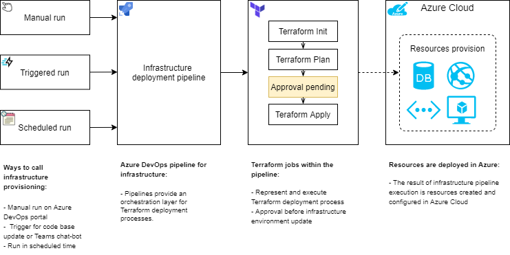

[[_TOC_]]

# Introduction

This section describes how to organize Terraform code development process, documentation stage and code contribution approach.

# Concepts

The IaC development and deployment processes are similar to a normal development process and include local development, test writing, branching strategy, and CI/CD automation.

For this purpose, we defined three main parts here:

- Terraform modules development;
- Terraform code configuration development;
- Automated infrastructure deployment via Azure DevOps pipelines.

The diagram below shows the overall SDLC process for Terraform IaC development:

[Infrastructure_development_and_provision process.xml](./.attachments/Infrastructure_development_and_provision.xml)

Branch policies allow us to validate Terraform code during development process by the "terraform validate" and "liamg/tfsec" tools to check syntax and potential security issues.

The infrastructure described in Terraform code could be provisioned by Azure DevOps pipelines by manual, triggered, or scheduled run as shown in the diagram below:

[Infrastructure_provision_process.xml](./.attachments/Infrastructure_provision_process-7e7298fb-2adf-4426-ada8-2a2305294453.xml)

## Providers

Terraform relies on plugins called "providers" to interact with cloud providers, SaaS providers, and other APIs. Example: azurerm, azuredevops, aws, gcp, etc.
The configuration must declare which providers require so that Terraform can install and use them, these providers may require some additional configuration before they can be used.

## Modules

Modules are the main way to package and reuse configuration with Terraform. They are containers for resources that can be used together, a module usually consist of a collection `.tf` and/or `.tf.json` files kept together in a single directory.

### Child modules

A Terraform child module represents a fundamental building block comprising a logical resource, along with optional additional components. It is designed to manage a single, standalone infrastructure resource. Child modules can either be invoked by other modules or utilized independently.

### Root module

The Terraform root module is primarily utilized for infrastructure management and may contain multiple resources in .tf files located within the working directory. These .tf files can include calls for other modules (typically child modules), resources, data sources, outputs, variables, and locals. Root modules often encompass extensive logic based on various resource types and/or possess the capability to deploy multiple resource instances.