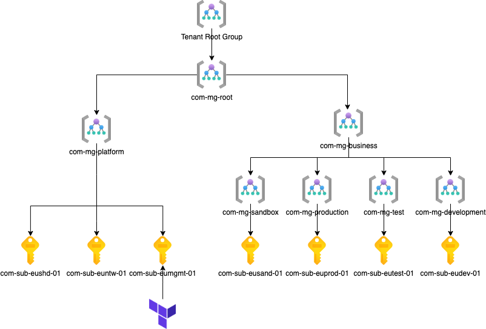
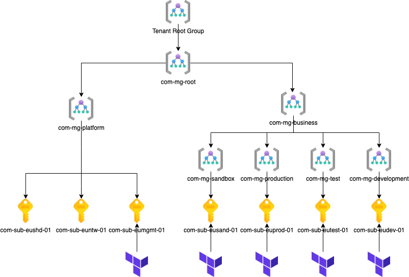
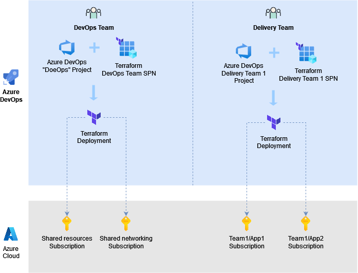
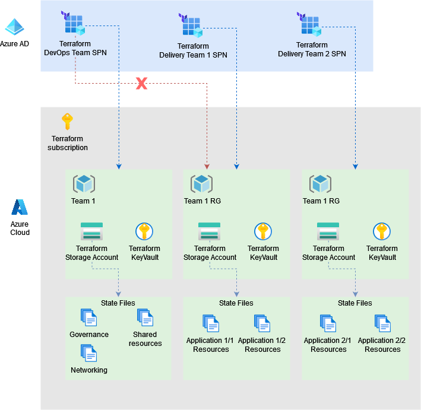

[[_TOC_]]

# Introduction

Terraform state file stores information about deployed resources and their configuration.
Sometimes the configuration supposes that it is required to pass and configure sensitive values like Azure Key Vault secrets, Virtual Machines passwords, etc.
So Terraform by design keeps all this sensitive information in the state file in plain text.

Normally the state file is stored on shared resources to allow team collaboration when working with infrastructure development and maintenance via Terraform.
Storing the state file on the shared resources or "remote backends" is out-of-the-box functionality and is supports different types of cloud storage.

So taking into consideration the fact the Terraform keeps sensitive data in the state file as plain text and the state file is stored on the shared resource which is "remote backend" it is important to provide a good security model to protect the state from unapproved access and prevent leaking of sensitive information.

In Azure Cloud, Terraform uses a storage account as the state file backend.

# Azure subscription

The Azure Cloud security model configures inheritance for all resources nested within resource groups or a specific subscription.

This implies that if a permission is configured at the subscription level, it will be propagated to all resources within the subscription, including resource groups with Terraform storage account with Terraform state files inside.

To enhance security, one option is to move the storage accounts used for the Terraform backend to a separate subscription. This approach is suitable when there is a dedicated team responsible for managing the entire infrastructure lifecycle. The diagram below illustrates the subscription model, taking into account that the Terraform backend will be placed in a separate subscription:

However, in cases where there are multiple dedicated teams working on different tasks, and each team must have the ability to manage their own dedicated environment based on an Azure Subscription, an alternative approach can be used. This approach allows teams to manage standalone, self-contained environments with their own Terraform automation assets, such as pipelines, configuration and module files, and an independent Azure storage account to store the Terraform state files for the specific environment.

[Terraform_subscription.drawio.xml](./.attachments//Terraform_subscription.drawio.xml)

# Azure service principal

For Terraform deployment automation it is recommended to use service principal (SP) to access the Azure subscriptions.

The SP could be created one per team which is going to manage infrastructure and then stored within Azure DevOps.
Having several SPs allows to manage access to resources granularly and avoid possible infrastructure corruption when having only one Terraform SP with unlimited permissions.

The SP secret is stored within Azure DevOps variable groups or mapped through variable group from Azure Key Vault as secure variable and used during the automated deployments.

# Azure resource groups

The SPs mentioned above are not only used to manage resources in Azure, but to manage state files as well in the dedicated subscriptions. The state files are stored on storage accounts and the storage accounts are placed in separate resource groups.

Following the idea of several SPs for automated deployments, the number of resource groups should be equal to SPs amount. The main idea is to have one resource group per SP.

The service principal will have **Contributor** or **Owner** access to target subscriptions and **Contributor** to its resource group with a storage account.

All these Terraform resource groups within the dedicated subscription have at least one storage account and optional Azure Key Vaults if used.

# Azure storage account

An Azure storage account serves as the Terraform backend storage, enabling enhanced team collaboration by sharing Terraform state files through a dedicated storage point. This method securely stores Terraform state files and protects them from accidental deletion. When discussing secure storage, various techniques can be employed to safeguard data from unauthorized access. These include granting access from a specific virtual network or/and IP range and allowing access to storage account content for service principals used in automation, as well as specific users/groups responsible for infrastructure management who require access.

## Azure storage account data protection

The following storage account features are used to increase Terraform state availability and to protect it from accidental deletion or corruption:

|Feature|Applied value| Explanation |
|--|--|--|
|SKU type|Standard_GRS|State files are replicated to another region for fault-tolerance scenario without creating additional resources|
|blob versioning|Enabled by default|Every write operation to a state file creates a file new version. The current version of a file may be restored from a previous version if the current version is deleted or overwritten|
|blob soft delete|Enabled by default, retention time is 30 days|A deleted blob or blob version may be restored within the retention period.|
|change feed|Enabled by default, retention time is 180 days|Provides transaction logs of all the changes that occur to the blobs and the blob metadata in your storage account|

The applied configuration is recommended and can be overridden in the:
- _configuration/000_prerequisites/sa_template.json file if you deploy your infrastructure as terraform modules.
- _configuration/_solutions/*/000_prerequisites/sa_template.json files if you deploy your infrastructure as solution pipeline.

# Azure Key Vault

The Azure Key Vault is required to host secrets and certificates which are required during infrastructure bootstrap, like App Gateway, shared VMs, AKS configuration.

That means when we start the infrastructure deployment from scratch we sometimes need to configure Administrator passwords for VMs, SQL servers or put a certificate on Application Gateway.
And for this reason, it is required to have some zero-point Azure Key Vault to keep these secrets there. So Terraform can get them during its execution and put them to the target resources (VMs, SQL, AppGateway).

The Azure Key Vault is hosted within the same resource groups as storage account to have the ability to limit access to them for different teams.